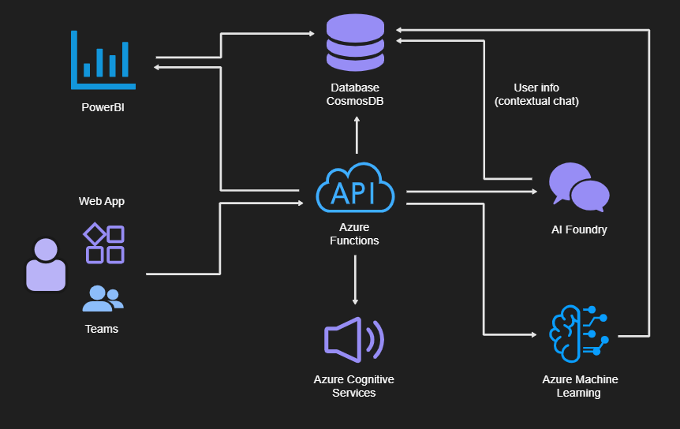

# AVANOCHI
Aplicación de `productividad` con un enfoque lúdico, diseñada para mejorar la `gestión del tiempo` y el `rendimiento` durante la jornada laboral. Avanochi funciona como un “tamagochi” productivo, que motiva al empleado mientras organiza sus tareas, mide su rendimiento y promueve hábitos saludables.

## 1. Objetivos
- `Incrementar la productividad` y organización personal.
- Promover `hábitos laborales saludables` mediante recordatorios.
- Ofrecer `estadísticas y recomendaciones` personalizadas mediante IA.
- Integrar la gestión de tareas con un `sistema interactivo y gamificado`.

## 2. Recursos de Azure propuestos
- Gestión de tareas (To-Do list gamificada)
    - Crear, consultar y actualizar `tareas diarias y semanales`.
    - Registro automático de `progreso y tiempos invertidos`.

- Asistente inteligente (IA Foundry)
    - `Consejos de organización` según carga laboral y hábitos previos.
    - `Ajuste dinámico del horario` en base al rendimiento histórico.
    - `Voice assistant` para poder interactuar con el como si fuera un compañero mas

- Avanochi multicanal (Bot Service + Speech Services)
    - Interacción por `voz y chat` con Avanochi.  
    - Integración en `Teams/Slack` como compañero virtual.  
    - Envío de `recordatorios hablados` y respuestas naturales.  

- Generación de informes narrativos (Azure OpenAI / AI Foundry)
    - Creación de `resúmenes semanales` en lenguaje natural.  
    - Explicación de `rendimiento, descansos y hábitos` de forma personalizada.  
    - Ejemplo: “Esta semana trabajaste un 15% más rápido en tareas creativas, pero descuidaste los descansos de media tarde…”  

- Logros y recompensas (Functions + Cosmos DB)
    - Sistema de `trofeos y logros` por constancia y hábitos saludables.  
    - Ejemplo: “7 días hidratado”, “0 horas extra en la semana”.  
    - Refuerzo de la `motivación y el bienestar` del usuario.  

- Mapas de calor de productividad (Cosmos DB + Power BI)
    - Visualización de `estadísticas de productividad` en distintas horas del día.  
    - Identificación de `momentos de máximo rendimiento`.  
    - Ayuda en la `planificación óptima` de la jornada laboral.  

- Predicciones de sobrecarga (Azure Machine Learning + Functions)
    - Modelo de IA para `anticipar sobrecargas laborales`.  
    - Generación de `alertas preventivas` si se prevé trabajar más de 9h.  
    - Prevención de `estrés y exceso de horas`.  

## 3. Features
- Estadísticas de rendimiento
    - `Horas trabajadas` diarias y semanales.
    - `Tareas completadas vs pendientes` por cada jornada.
    - Control de `descansos`.

- Integración “Healthy life”
    - `Jornada de trabajo`: Avanochi trabaja a tu lado. Si superas las 8,5h, se cansa y te pide descansar, igual que él.
    - `Hora de comer`: Avanochi necesita comer. Si no le das de comer, asume que tú tampoco lo has hecho y te recuerda parar para almorzar.
    - `Hidratación`: Avanochi tiene sed periódicamente. Cuando le das agua, entiendes que también debes hidratarte.

## 4. Caso de uso
1. El empleado inicia sesión en Avanochi al `comenzar su jornada`.
2. Si es lunes, se cargan las tareas pendientes de la semana anterior o se generan nuevas.
3. Durante el día:
    - El empleado marca `avances en las tareas`.
    - Avanochi registra `tiempos, descansos y progreso`.
    - `Recomienda pausas` si detecta sobrecarga.
4. Al final de la jornada:
    - Se realiza un `resumen de horas, tareas y descansos`.
    - Se generan `estadísticas de rendimiento`.
    - Se preparan `recomendaciones para el día siguiente`.

## 5. Aprendizaje continuo
El modelo de IA `analiza el historial de trabajo del empleado` y ajusta las recomendaciones con el tiempo, personalizando horarios y estrategias para `optimizar la productividad`.

Las métricas para evaluar la productividad serían las siguientes:

### Métricas de productividad

| Métrica                                   | Propósito                                                                 |
|-------------------------------------------|---------------------------------------------------------------------------|
| Horas trabajadas                          | Medir la carga diaria y semanal del empleado.                             |
| Tiempo en tareas activas vs. inactivo     | Detectar productividad real frente a tiempos muertos.                     |
| Número de tareas completadas vs. pendientes | Evaluar cumplimiento de objetivos diarios y semanales.                   |
| Progreso porcentual de tareas             | Ver el avance sobre lo planificado.                                       |
| Tiempo promedio por tarea                 | Identificar eficiencia en la ejecución de tareas.                         |
| Desviación entre tiempo estimado y real   | Mejorar la planificación futura y la precisión en estimaciones.           |
| Número y duración de descansos            | Asegurar un balance saludable durante la jornada.                         |
| Cumplimiento de descansos recomendados    | Medir si el empleado sigue las recomendaciones de Avanochi.               |
| Balance trabajo-descanso                  | Prevenir sobrecargas y fomentar hábitos sostenibles.                      |
| Horarios de inicio y fin de jornada       | Analizar consistencia y disciplina en la rutina laboral.                  |
| Días con sobrecarga laboral               | Detectar exceso de horas trabajadas (más de 8,5h).                        |
| Nivel de regularidad semanal              | Observar patrones de rendimiento a lo largo de la semana.                 |
| Tareas reprogramadas o arrastradas        | Identificar retrasos o dificultades recurrentes.                          |
| Tiempo de respuesta al feedback de Avanochi | Medir la efectividad de las recomendaciones dadas.                       |
| Frecuencia de interacciones con Avanochi  | Evaluar adopción y uso del sistema por parte del empleado.                |

## Roadmap por Fases - Proyecto Avanochi

### Fase 1: MVP (Producto Mínimo Viable)
**Objetivo:** Validar la idea con un prototipo funcional y simple.  
**Alcance:**
- Gestión básica de tareas (crear, consultar, completar).
- Registro de horas de inicio y fin de jornada.
- Estadísticas iniciales: horas trabajadas y tareas completadas.
- Versión simple de Avanochi (interfaz visual básica tipo tamagochi).
- Base de datos inicial en **Cosmos DB** para persistencia.

**Entregable:** Una aplicación sencilla que muestre a Avanochi reaccionando al progreso del usuario y con métricas básicas.

---

### Fase 2: Productividad + Gamificación
**Objetivo:** Aumentar el engagement y la utilidad de la app.  
**Alcance:**
- Registro automático de tiempos en tareas.
- Control manual de descansos (ej. marcar “descanso iniciado”).
- Logros y recompensas básicos (ej. tareas completadas en un día, cumplir con pausas).
- Notificaciones simples (recordatorios por hora o por tarea).
- Dashboards básicos con **Power BI** (tareas completadas, horas trabajadas).

**Entregable:** Una app gamificada con primeros elementos de motivación y métricas visuales.

---

### Fase 3: Inteligencia y Recomendaciones
**Objetivo:** Integrar IA para personalización.  
**Alcance:**
- Análisis de hábitos laborales (Azure AI / AI Foundry).
- Recomendaciones básicas: cuándo tomar descansos, priorizar tareas.
- Resúmenes diarios y semanales en lenguaje natural.
- Ajustes dinámicos en la agenda según desempeño histórico.
- Identificación de sobrecarga (alerta si supera 8,5h/día).

**Entregable:** Avanochi como asistente inteligente que analiza tu jornada y da consejos personalizados.

---

### Fase 4: Interacción Multicanal
**Objetivo:** Extender la experiencia más allá de la app.  
**Alcance:**
- Integración en **Teams/Slack** como compañero virtual.
- Soporte de voz mediante **Azure Speech Services**.
- Avanochi capaz de interactuar en chat o voz de manera natural.
- Recordatorios hablados y notificaciones en plataformas externas.

**Entregable:** Avanochi disponible como un compañero digital accesible desde múltiples canales.

---

### Fase 5: Bienestar y Salud Laboral
**Objetivo:** Reforzar la dimensión saludable.  
**Alcance:**
- Funciones “Healthy life”: hidratación, comidas, descansos.
- Avanochi “se cansa” si trabajas demasiado.
- Logros saludables (ej. “7 días hidratado”).
- Balance automático trabajo/descanso como métrica clave.

**Entregable:** Una app que combina productividad con bienestar, reforzando hábitos saludables.

---

### Fase 6: Analítica Avanzada y Predicción
**Objetivo:** Anticipar problemas y optimizar al máximo.  
**Alcance:**
- Mapas de calor de productividad por hora/día (Cosmos DB + Power BI).
- Predicciones de sobrecarga laboral mediante **Azure Machine Learning**.
- Informes narrativos enriquecidos (ej. “Eres más eficiente en tareas creativas por la mañana”).
- Ajustes automáticos en la planificación futura.

**Entregable:** Avanochi como copiloto de productividad, con analítica avanzada y capacidades predictivas.

---

### Fase 7: Optimización y Expansión
**Objetivo:** Escalabilidad y evolución del ecosistema.  
**Alcance:**
- Optimización de modelos y experiencia de usuario.
- Internacionalización (multi-idioma).
- Integración con calendarios corporativos (Outlook, Google Calendar).
- API abierta para terceros (plugins, integraciones).

**Entregable:** Plataforma madura y escalable, lista para adopción masiva.

