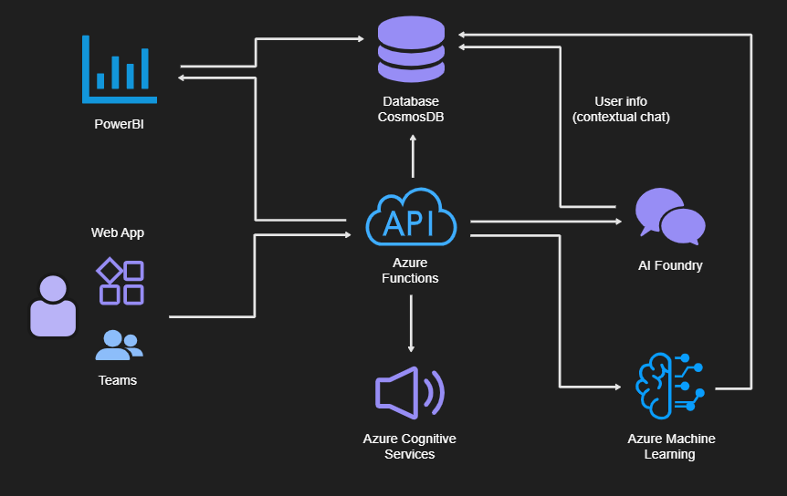

# AVANOCHI
Productivity application with a playful approach, designed to improve `time management` and `performance` during the workday. Avanochi works as a productive "tamagochi", motivating the employee while organizing their tasks, measuring performance, and promoting healthy habits.

    

## 1. Objectives
- `Increase productivity` and personal organization.
- Promote `healthy work habits` through reminders.
- Offer personalized `statistics and recommendations` using AI.
- Integrate task management with an `interactive and gamified system`.

## 2. Proposed Azure resources
- Task management (Gamified To-Do list)
    - Create, view, and update `daily and weekly tasks`.
    - Automatic logging of `progress and time spent`.

- Intelligent assistant (AI Foundry)
    - `Organizational advice` according to workload and previous habits.
    - `Dynamic schedule adjustment` based on historical performance.
    - `Voice assistant` to interact as if it were another teammate.

- Avanochi multichannel (Bot Service + Speech Services)
    - Interaction via `voice and chat` with Avanochi.  
    - Integration into `Teams/Slack` as a virtual teammate.  
    - Sending of `spoken reminders` and natural responses.  

- Narrative report generation (Azure OpenAI / AI Foundry)
    - Creation of `weekly summaries` in natural language.  
    - Explanation of `performance, breaks, and habits` in a personalized way.  
    - Example: “This week you worked 15% faster on creative tasks, but neglected your mid-afternoon breaks…”  

- Achievements and rewards (Functions + Cosmos DB)
    - System of `trophies and achievements` for consistency and healthy habits.  
    - Example: “7 days hydrated”, “0 overtime hours this week”.  
    - Reinforcement of the user’s `motivation and well-being`.  

- Productivity heat maps (Cosmos DB + Power BI)
    - Visualization of `productivity statistics` at different times of the day.  
    - Identification of `peak performance moments`.  
    - Assistance in `optimal daily planning`.  

- Overload predictions (Azure Machine Learning + Functions)
    - AI model to `anticipate work overloads`.  
    - Generation of `preventive alerts` if working more than 9h is expected.  
    - Prevention of `stress and excessive hours`.  

## 3. Features
- Performance statistics
    - Daily and weekly `hours worked`.
    - `Completed vs pending tasks` per workday.
    - `Break control`.

- “Healthy life” integration
    - `Workday`: Avanochi works alongside you. If you exceed 8.5h, it gets tired and asks you to rest, just like it does.
    - `Mealtime`: Avanochi needs to eat. If you don’t feed it, it assumes you haven’t eaten either and reminds you to stop for lunch.
    - `Hydration`: Avanochi gets thirsty periodically. When you give it water, you also understand you should hydrate.

## 4. Use case
1. The employee logs in to Avanochi at the `start of their workday`.
2. If it’s Monday, pending tasks from the previous week are loaded or new ones are generated.
3. During the day:
    - The employee marks `progress on tasks`.
    - Avanochi records `time, breaks, and progress`.
    - `Recommends breaks` if overload is detected.
4. At the end of the day:
    - A `summary of hours, tasks, and breaks` is generated.
    - `Performance statistics` are created.
    - `Recommendations for the next day` are prepared.

## 5. Continuous learning
The AI model `analyzes the employee’s work history` and adjusts recommendations over time, personalizing schedules and strategies to `optimize productivity`.

The metrics to evaluate productivity would be the following:

### Productivity metrics

| Metric                                  | Purpose                                                                 |
|-----------------------------------------|-------------------------------------------------------------------------|
| Hours worked                            | Measure the employee’s daily and weekly workload.                       |
| Time in active vs inactive tasks        | Detect real productivity versus downtime.                               |
| Number of completed vs pending tasks    | Evaluate achievement of daily and weekly objectives.                    |
| Percentage progress of tasks            | Track progress against the plan.                                        |
| Average time per task                   | Identify efficiency in task execution.                                  |
| Deviation between estimated and actual time | Improve future planning and accuracy in estimates.                    |
| Number and duration of breaks           | Ensure a healthy balance during the day.                                |
| Compliance with recommended breaks      | Measure if the employee follows Avanochi’s recommendations.             |
| Work-break balance                      | Prevent overloads and promote sustainable habits.                       |
| Start and end times of the workday      | Analyze consistency and discipline in work routine.                     |
| Days with work overload                 | Detect excessive work hours (more than 8.5h).                           |
| Weekly regularity level                 | Observe performance patterns throughout the week.                       |
| Rescheduled or carried-over tasks       | Identify recurring delays or difficulties.                              |
| Response time to Avanochi feedback      | Measure effectiveness of recommendations.                               |
| Frequency of interactions with Avanochi | Evaluate employee’s adoption and system usage.                          |

# Roadmap by Phases - Avanochi Project
 

    

## Phase 1: MVP (Minimum Viable Product)
**Objective:** Validate the idea with a functional and simple prototype.  
**Scope:**
- Basic task management (create, view, complete).
- Logging of workday start and end times.
- Initial statistics: hours worked and tasks completed.
- Simple version of Avanochi (basic tamagochi-style visual interface).
- Initial database in **Cosmos DB** for persistence.
 
**Deliverable:** A simple application showing Avanochi reacting to the user’s progress with basic metrics.
 
---
 
## Phase 2: Productivity + Gamification
**Objective:** Increase engagement and usefulness of the app.  
**Scope:**
- Automatic logging of task times.
- Manual control of breaks (e.g., mark “break started”).
- Basic achievements and rewards (e.g., tasks completed in a day, comply with breaks).
- Simple notifications (hourly or per task reminders).
- Basic dashboards with **Power BI** (tasks completed, hours worked).
 
**Deliverable:** A gamified app with initial motivational elements and visual metrics.
 
---
 
## Phase 3: Intelligence and Recommendations
**Objective:** Integrate AI for personalization.  
**Scope:**
- Analysis of work habits (Azure AI / AI Foundry).
- Basic recommendations: when to take breaks, prioritize tasks.
- Daily and weekly summaries in natural language.
- Dynamic schedule adjustments based on historical performance.
- Overload identification (alert if over 8.5h/day).
 
**Deliverable:** Avanochi as an intelligent assistant analyzing your day and giving personalized advice.
 
---
 
## Phase 4: Multichannel Interaction
**Objective:** Extend the experience beyond the app.  
**Scope:**
- Integration into **Teams/Slack** as a virtual teammate.
- Voice support via **Azure Speech Services**.
- Avanochi able to interact naturally in chat or voice.
- Spoken reminders and notifications in external platforms.
 
**Deliverable:** Avanochi available as a digital companion accessible from multiple channels.
 
---
 
## Phase 5: Workplace Wellness and Health
**Objective:** Reinforce the healthy dimension.  
**Scope:**
- “Healthy life” features: hydration, meals, breaks.
- Avanochi “gets tired” if you work too much.
- Healthy achievements (e.g., “7 days hydrated”).
- Automatic work-rest balance as a key metric.
 
**Deliverable:** An app combining productivity with wellness, reinforcing healthy habits.
 
---
 
## Phase 6: Advanced Analytics and Prediction
**Objective:** Anticipate problems and maximize optimization.  
**Scope:**
- Productivity heat maps by hour/day (Cosmos DB + Power BI).
- Work overload predictions using **Azure Machine Learning**.
- Enriched narrative reports (e.g., “You are more efficient at creative tasks in the morning”).
- Automatic adjustments in future planning.
 
**Deliverable:** Avanochi as a productivity copilot with advanced analytics and predictive capabilities.
 
---
 
## Phase 7: Optimization and Expansion
**Objective:** Scalability and ecosystem evolution.  
**Scope:**
- Optimization of models and user experience.
- Internationalization (multi-language support).
- Integration with corporate calendars (Outlook, Google Calendar).
- Open API for third parties (plugins, integrations).
 
**Deliverable:** Mature and scalable platform, ready for mass adoption.
