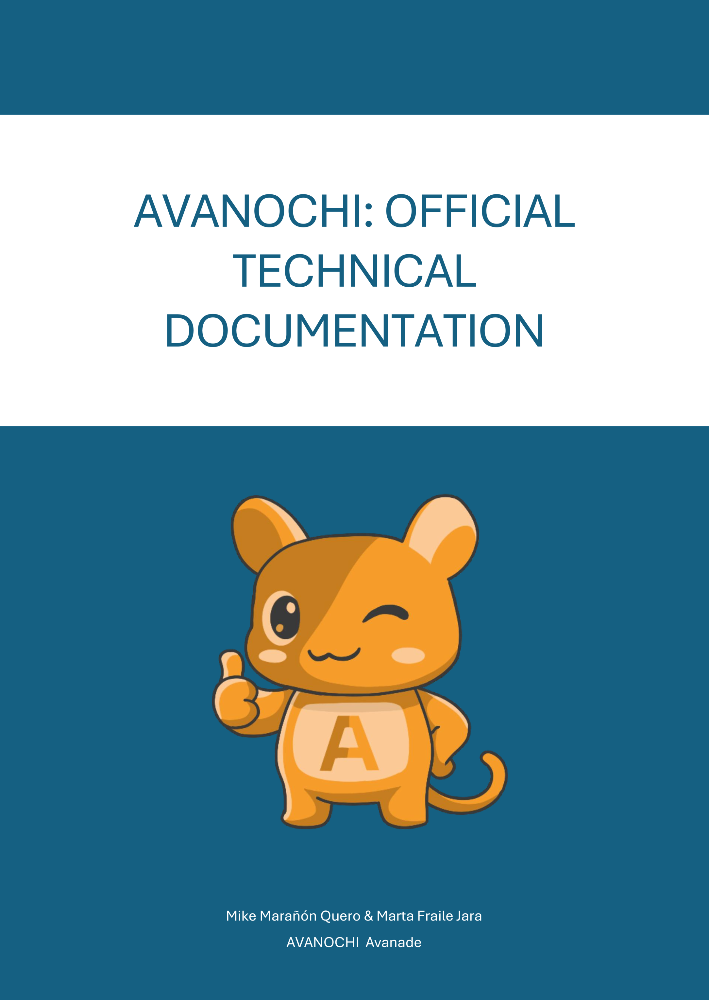
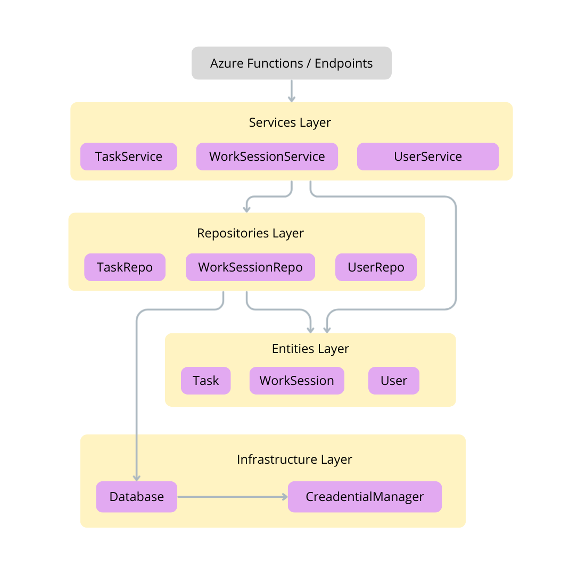

<p align="center">
    
</p>

<div class="page-break"></div>

# Table of Contents

- [Table of Contents](#table-of-contents)
- [Introduction](#introduction)
    - [Purpose of the project](#purpose-of-the-project)
- [1. General Architecture: Azure Functions](#1-general-architecture-azure-functions)
    - [1.1 AZ_functions directory](#11-az_functions-directory)
        - [1.1.1 Structure Overview](#111-structure-overview)
            - [`.shared` Architecture](#shared-architecture)
                - [Credential Manager](#credential-manager)
                - [Database: CosmosDB](#database-cosmosdb)
                - [Authentication Manager](#authentication-manager)
                - [Entities](#entities)
                - [Repositories](#repositories)
                - [Services](#services)
            - [Endpoints: `work` Directory](#endpoints-work-directory)
                - [Auth Endpoint](#auth-endpoint)
                - [Stats Endpoint](#stats-endpoint)
                - [Tasks Endpoint](#tasks-endpoint)
                - [WorkSessions Endpoint](#worksessions-endpoint)
    - [1.2 Azure Functions Testing](#12-azure-functions-testing)
        - [1.2.1 `function_app.py`: central endpoint manager](#121-function_apppy-central-endpoint-manager)
        - [1.2.2 Virtual environment](#122-virtual-environment)
        - [1.2.3 Enviroment Variables](#123-enviroment-variables)
        - [1.2.4 Final testing](#124-final-testing)

<div class="page-break"></div>

# Introduction

This is the official documentation of the [AVANOCHI](https://github.com/Avanochi-project/AVANOCHI) project. Every code and architectural decision involved will be explained here in detail.  

**AVANOCHI** is a productivity application with a playful and gamified approach, designed to enhance **time management**, **work performance**, and **well-being** during the workday. The project introduces a virtual companion — a “productive tamagotchi” — that not only motivates employees but also assists in organizing tasks, tracking performance, and promoting healthy work habits.  

At its core, AVANOCHI bridges **task management**, **behavioral gamification**, and **AI-powered insights** to create an engaging system that goes beyond traditional productivity tools. Unlike conventional task trackers, AVANOCHI establishes an emotional connection with the user: the character reacts to the employee’s actions, encourages breaks, and evolves alongside the worker’s performance. This interaction transforms daily work into a dynamic and rewarding experience, increasing motivation while reducing stress and fatigue.  

The platform is designed with **modularity** and **scalability** in mind, leveraging modern cloud resources and AI-driven features. It integrates with Microsoft Azure services for data storage, analytics, AI recommendations, and voice/chat interaction. This ensures that the system not only adapts to individual needs but also continuously improves through **machine learning and data-driven feedback**.  

## Purpose of the project

The main goal of AVANOCHI is to support employees in achieving higher productivity while maintaining a healthy work-life balance. To accomplish this, the system:  

- Encourages **organization** through daily and weekly task management.  
- Provides **real-time performance tracking** and visual statistics.  
- Promotes **healthy habits** such as hydration, breaks, and proper lunch times.  
- Uses **gamification elements** (achievements, rewards, character evolution) to increase engagement.  
- Offers **personalized recommendations** powered by AI, adapting to each employee’s work rhythm.  
- Predicts risks of **work overload and burnout**, sending alerts before they happen.  
- Extends productivity beyond the app itself with **multichannel integration** (Teams, Slack, voice assistant).  

In summary, AVANOCHI is not just a productivity app, but a **digital companion** that combines technology, gamification, and well-being to redefine the way employees interact with their workday.  


<div class="page-break"></div>

# 1. General Architecture: Azure Functions

Avanochi is built on a **serverless architecture** using Microsoft Azure Functions. This approach was chosen to ensure scalability, modularity, and cost efficiency. Instead of relying on a traditional web server that requires continuous maintenance and resource allocation, serverless functions allow us to run code only when specific events are triggered. This event-driven model aligns perfectly with Avanochi’s needs, where different modules—such as task tracking, AI recommendations, and health reminders—can operate independently without interfering with each other.  

By adopting a serverless structure, we gain several advantages: reduced operational overhead, automatic scaling according to workload, and seamless integration with other Azure services like Cosmos DB, AI Foundry, and Speech Services. This design ensures that Avanochi remains lightweight yet powerful, focusing development efforts on **business logic and user experience** rather than infrastructure management.  

## 1.1 AZ_functions directory
The AZ_functions module serves as the backbone of Avanochi’s cloud logic. It organizes all serverless functions into thematic domains, each responsible for a specific aspect of the application. This modular layout naturally aligns with Azure Functions’ event-driven model: each directory encapsulates functions tied to specific triggers and responsibilities.  

Such organization simplifies both development and testing by isolating functionalities into independent domains. Each domain can evolve on its own lifecycle, making it easier to extend or replace components without affecting the rest of the system. The result is a clean, predictable architecture that supports continuous integration and long-term maintainability, while keeping the cloud logic transparent and easy to navigate.

### 1.1.1 Structure Overview
- `.shared/`: This module ensures consistency, reusability, and maintainability, reducing code duplication across the system.
    - Centralizes cross-cutting concerns and reusable components for all other modules.
    - init.py: Marks the package as importable and optionally exposes shared interfaces.
    - `credential_manager.py`: Handles secure authentication and credential rotation.
    - `database.py`: Defines the database connection layer and abstracts CRUD operations.
    - `auth_manager.py`: Encapsulates JWT generation and validation. It isolates token logic (signing, verification, expiration) from higher layers.
    - `entities/`: Declares data models and schemas used across functions.
    - `repos/`: Implements the repository pattern, linking entities with database logic.
    - `services/`: Provides high-level services that orchestrate business logic and integrations.

- `assistant/`
    - Includes AI-driven features such as *narratives*, *predictions*, and *recommendations*.
    - These functions process historical data, generate natural language summaries, and provide personalized insights to the user.
    - Acts as the decision-making hub of Avanochi’s assistant role.

- `interaction/`
    - Handles user interaction layers such as bot communication, notifications, and voice integration.
    - Designed for multi-channel experiences, enabling seamless integration with chat platforms (Teams, Slack) and voice systems (Azure Speech Services).

- `health/`
    - Manages well-being functionalities: hydration, meals, and rests.
    - Functions here send reminders, track user inputs, and contribute to the healthy-life dimension of the project.
    - These elements directly influence the gamified Avanochi “persona”.

- `work/`
    - Dedicated to productivity tracking: achievements, stats, tasks, and work sessions.
    - Core logic for task management, progress measurement, and session recording resides here.
    - This module feeds most of the gamification system, unlocking achievements and performance insights.

- Configuration files
    - `host.json` and `local.settings.json` define the runtime environment and local development setup.
    - Ensure consistency between cloud deployment and local testing

- `templates/`
    - Stores pre-defined templates such as `cosmosdb.json`
    - Provides ready-to-use schemas for database bindings and resource definitions

<div class="page-break"></div>

#### `.shared` Architecture
The `.shared` module is a foundational layer that centralizes all cross-cutting concerns within the AZ_functions ecosystem. It ensures that domain-specific functions (assistant, health, interaction, work) can focus purely on their logic, while shared components provide common services, models, and infrastructure handling.

Here we have an structural Overview of the logic it follows:

<p align="center">
    
</p>

<div class="page-break"></div>

##### Credential Manager
This module is responsible for managing authentication and secure access to the project’s external resources, such as **CosmosDB**, **Azure services**, or third-party APIs. It centralizes all credential-related logic, including retrieval from secure environments and, when required, automatic rotation of secrets. 
By handling this complexity in one place, the rest of the system is shielded from directly managing tokens or sensitive keys. This not only reduces the exposure of confidential information but also ensures compliance with security best practices. In essence, it acts as a security gateway, guaranteeing that all external connections are performed safely and consistently.

The main working logic can be divided into two main functions:
- **General method `get()`**  
    This method will get an input of the expected key and a default value, so that any key can be looked up for in the credential library. if no key is found, it will return the default value
    ```python
    def get(self, key: str, default: str = None):
        # Retrieve any environment variable by key.
        return os.getenv(key, default)
    ```
- **Specific methods**  
    For each service that requires authentication methods through API keys or special endpoints, there will be specific methods such as the `get_cosmos_credentials()` method, that will return a list of keys only needed in the `CosmosDBService` class. any other service method shall be coded in `CredentialManager` class to keep a clean use of the credential extraction and not abuse the `get()` method
    ```python
    def get_cosmos_credentials(self):        
        # Retrieve Cosmos DB credentials from environment variables.
        return {
            "account_name": os.getenv("COSMOS_DB_ACCOUNT", ""),
            "database_name": os.getenv("COSMOS_DB_DATABASE", ""),
            "container_name": os.getenv("COSMOS_DB_CONTAINER", ""),
            "uri": os.getenv("COSMOS_DB_URI", ""),
            "primary_key": os.getenv("COSMOS_DB_PRIMARY_KEY", "")
        }
    ```

##### Database: CosmosDB
This module is responsible for handling all interactions with Azure Cosmos DB, ensuring that data persistence is managed in a centralized and secure manner.
The CosmosDBService class abstracts the complexity of creating and maintaining the connection to Cosmos DB, making sure that the required database and container exist before any operation is performed.
By depending exclusively on the `CredentialManager` to retrieve its credentials, this class adheres to the Single Responsibility Principle, keeping authentication logic separated from database logic. This approach guarantees scalability, maintainability, and consistent usage of environment-based configurations.
The main responsibilities can be divided into the following components:

- **Initialization (`__init__`)**: The constructor receives a `CredentialManager` instance and prepares the service for interacting with Cosmos DB.  
At this stage, only the credential manager is stored. Depending on the chosen strategy, the database connection may be established immediately (**eager initialization**) or deferred until needed (**lazy initialization**).

    ```python
    def __init__(self, credential_manager: CredentialManager):
        self._credential_manager = credential_manager
        self._client = None
        self._database = None
        self._container = None
    ```

- **Lazy Connection Handling (`_ensure_connection`)**: This private method guarantees that the **Cosmos DB client, database, and container are initialized**.
It is invoked internally by CRUD operations before performing any interaction with the database.
This approach ensures that the service can start even if Cosmos DB is temporarily unavailable during app startup, making it ideal for Azure Functions.

    ```python
    def _ensure_connection(self):
        if self._client is None:
            creds = self._credential_manager.get_cosmos_credentials()
            url = creds["uri"]
            key = creds["primary_key"]
            database_name = creds["database_name"]
            container_name = creds["container_name"]

            # Create client and ensure database + container
            self._client = CosmosClient(url, key)
            self._database = self._client.create_database_if_not_exists(id=database_name)
            self._container = self._database.create_container_if_not_exists(
                id=container_name,
                partition_key=PartitionKey(path="/id"),
                offer_throughput=400
            )
    ```

- **Database methods**: The `CosmosDBService` provides a set of generic CRUD methods and query execution helpers that abstract direct interaction with Cosmos DB:

    - `create_item()`: Inserts a new document into the container. Automatically generates a unique `id` if not provided and validates the presence of a `user_id`.

    ```python
    def create_item(self, item: dict) -> dict:
        try:
            # Ensure unique ID
            if "id" not in item:
                item["id"] = str(uuid.uuid4())

            if "user_id" not in item:
                raise DatabaseError("Missing required field: 'user_id'")

            created = self._container.create_item(body=item)
            logging.info(f"Item created with id={created['id']}")
            return created
        except exceptions.CosmosHttpResponseError as e:
            logging.error(f"Failed to create item: {e.message}")
            raise DatabaseError(f"Failed to create item: {e.message}") from e
    ```

    - `read_item()`: Retrieves a single document by its `id` and partition key. Raises a `DatabaseError` if the item is not found.

    ```python
    def read_item(self, item_id: str, partition_key: str) -> dict:
        try:
            return self._container.read_item(item=item_id, partition_key=partition_key)
        except exceptions.CosmosResourceNotFoundError:
            raise DatabaseError(f"Item with id '{item_id}' not found.")
        except exceptions.CosmosHttpResponseError as e:
            raise DatabaseError(f"Failed to read item '{item_id}': {e.message}") from e
    ```

    - `upsert_item()`: Inserts or updates a document. Ensures that `id` and `user_id` are present before performing the operation.

    ```python
    def upsert_item(self, item: dict) -> dict:
        try:
            if "id" not in item:
                item["id"] = str(uuid.uuid4())

            if "user_id" not in item:
                raise DatabaseError("Missing required field: 'user_id'")

            upserted = self._container.upsert_item(body=item)
            logging.info(f"Item upserted with id={upserted['id']}")
            return upserted
        except exceptions.CosmosHttpResponseError as e:
            logging.error(f"Failed to upsert item: {e.message}")
            raise DatabaseError(f"Failed to upsert item: {e.message}") from e
    ```

    - `delete_item()`: Deletes a document by its `id` and partition key. Logs the deletion attempt and raises a `DatabaseError` if the item does not exist.

    ```python
    def delete_item(self, item_id: str, partition_key: str) -> None:
        try:
            logging.info(f"Attempting to delete item with id={item_id}")
            self._container.delete_item(item=item_id, partition_key=partition_key)
        except exceptions.CosmosResourceNotFoundError:
            raise DatabaseError(f"Item with id '{item_id}' not found, cannot delete.")
        except exceptions.CosmosHttpResponseError as e:
            raise DatabaseError(f"Failed to delete item '{item_id}': {e.message}") from e
    ```

    - `send_query()`: Executes a custom SQL-like query against the container, supporting optional parameters and cross-partition queries. Debug logs include the query and provided parameters.

    ```python
    def send_query(self, query: str, parameters: list = None) -> list[dict]:
        if parameters is None:
            parameters = []
        try:
            logging.debug(f"Executing query: {query} | Parameters: {parameters or 'None'}")
            results = self._container.query_items(
                query=query,
                parameters=parameters,
                enable_cross_partition_query=True
            )
            return [item for item in results]
        except exceptions.CosmosHttpResponseError as e:
            raise DatabaseError(f"Query failed: {e.message}") from e
    ```

##### Authentication Manager
This module is responsible for handling all operations related to user authentication and authorization through **JSON Web Tokens (JWT)**. It centralizes token management, ensuring that identity handling is secure, consistent, and independent from higher-level services.
The `AuthManager` class abstracts the complexity of token creation and validation, isolating cryptographic logic from business workflows.
By depending exclusively on environment variables for its secret key and expiration settings, this class adheres to the Single Responsibility Principle, keeping configuration and token logic decoupled from authentication services. This design guarantees scalability, maintainability, and secure usage of environment-based secrets.

The main responsibilities can be divided into the following components:

- **Initialization(`__init__`)**: The constructor loads the JWT secret and configuration (expiration time, algorithm) from environment variables.
    This guarantees that sensitive values are never hardcoded in the codebase and can be rotated without modifying logic.

    ```python
    def __init__(self):
        self.secret = os.getenv("JWT_SECRET", "dev-secret")
        self.algorithm = "HS256"
        self.exp_minutes = int(os.getenv("JWT_EXP_MINUTES", "60"))
    ```

- **Token generation(`generate_token`)**: Creates a signed JWT embedding the user identity and expiration claims.
    The payload always includes a `sub` (subject, user id), `iat` (issued at), and `exp` (expiration).

    ```python
    def generate_token(self, user_id: str) -> str:
        now = datetime.datetime.utcnow()
        payload = {
            "sub": user_id,
            "iat": now,
            "exp": now + datetime.timedelta(minutes=self.exp_minutes)
        }
        return jwt.encode(payload, self.secret, algorithm=self.algorithm)
    ```

- **Token verification (`verify_token`)**: Decodes and validates a JWT against the configured secret and algorithm.
    It checks expiration, tampering, and malformed tokens. Returns the decoded payload if valid, or raises a controlled error when verification fails.

    ```python
    def verify_token(self, token: str) -> dict:
        try:
            payload = jwt.decode(token, self.secret, algorithms=[self.algorithm])
            return {"valid": True, "user_id": payload.get("sub")}
        except PyJWTError as e:
            return {"valid": False, "error": str(e)}
    ```

By centralizing JWT handling in `AuthManager`, the system maintains strict separation of concerns:
- `Repositories` remain focused on persistence.
- `Services` orchestrate workflows, relying on the repository.
- `AuthManager` is the single place where cryptographic token logic resides.

This ensures maintainability, testability, and easy rotation of security mechanisms without affecting higher-level components.

##### Entities
This module defines the **core domain entities** of the application.  
Entities are plain Python classes that represent the business objects of Avanochi, such as **tasks**, **work sessions**, and **users**.

They are designed with the **Single Responsibility Principle (SRP)** in mind:
- They only handle their own state and basic transformations.
- They are not aware of database operations or business orchestration.
- They provide serialization methods (`to_dict`) so that higher layers (repositories, services) can persist or transport them as dictionaries/JSON.

The folder structure will be explained bellow with each entity:
```bash
shared/
└── entities/
    ├── task.py
    ├── work_session.py
    └── user.py
```

- **Entity Tasks**
    Represents a single task in the system, having the following fields:
    - `id`: unique identifier (UUID)
    - `title`: short description of the task
    - `completed`: boolean status (default `false`)
    - `created_at`: UTC timestamp of the creation (ISO format)
    - `updated_at`: timestamp of the last update (optional)

    It contains only one method to return the `task` as a dictionary:

    ```python
    def to_dict(self):
        return self.__dict__
    ```

    The output would be something like this:

    ```json
    {
        "id": "3b9f7b8e-6d7a-4e3f-a23c-5a0efb9b72c9",
        "title": "Finish project report",
        "completed": false,
        "created_at": "2025-09-25T10:15:30.123456",
        "updated_at": null
    }
    ```

- **Entity WorkSession**
    Represents a session of productive work for a given user, having the following fields:
    - `id`: unique identifier (UUID)
    - `user_id`: identifier of the user who owns the session
    - `start_time`: UTC timestamp when the session started (ISO format).
    - `end_time`: UTC timestamp when the session ended (ISO format).
    - `duration`: session length in hours, stored as a float (rounded to 2 decimals).

    It contain two methods:
    - `end_session()`: sets the end_time to current UTC time and calculates duration in hours.
    - `to_dict()`: returns the session as a dictionary for storage or serialization.

    ```python
    def end_session(self):
        self.end_time = datetime.utcnow().isoformat()
        start = datetime.fromisoformat(self.start_time)
        end = datetime.fromisoformat(self.end_time)
        self.duration = round((end - start).total_seconds() / 3600, 2)

    def to_dict(self):
        return self.__dict__
    ```

example dictionary structure after ending a session:

```json
{
    "id": "f49d0c33-b6cf-4d77-a274-8903b38c8ed2",
    "user_id": "user_123",
    "start_time": "2025-09-25T09:00:00.000000",
    "end_time": "2025-09-25T11:30:00.000000",
    "duration": 2.5
}
```

- **Entity User**
    Represents a user of the system.

    Fields:
    - `id`: unique identifier (UUID)
    - `name`: display name of the user
    - `created_at`: UTC timestamp of user creation (ISO format)
    - `updated_at`: timestamp of the last update (optional)

    It contains only one method to return the `user` as a dictionary:

    ```python
    def to_dict(self):
        return self.__dict__
    ```

    output would be something like this:

    ```json
    {
        "id": "21e4e82b-03d2-4e15-8d73-ff3b8737f8b0",
        "name": "Alice",
        "created_at": "2025-09-26T08:15:45.123456",
        "updated_at": null
    }
    ```

##### Repositories

Repositories provide the formal interface to the persistence layer: they are the only components that encapsulate direct data access logic and present a consistent API for the rest of the application. Note that services are the layer that should be called by endpoints—services orchestrate business logic and call repositories; endpoints must not access CosmosDBService or CredentialManager directly, as those are implementation details of the persistence layer.

In practice, repositories define the **data access layer** of the application.  
They are responsible for persisting and retrieving domain entities, designed with the **Single Responsibility Principle (SRP)** in mind:  
- They only handle communication with the database.  
- They are not aware of business logic or entity rules.  
- They provide a clean abstraction that services can use without depending on database details.  

The folder structure will be explained bellow with each repo:
```bash
shared/
└── repos/
    ├── base_repo.py
    ├── auth_repo.py
    ├── stats_repo.py
    ├── task_repo.py
    ├── user_repo.py
    └── work_session_repo.py
```

- **BaseRepository**  
    `BaseRepository` is an **abstract class** that defines generic CRUD operations and query execution.  
    All concrete repositories inherit from this base class and implement their own `entity_type()` to identify the type of document they manage in the database.
 
    The methods provided are the following:  
    - `create(entity: dict) -> dict`  
    Persists a new entity in the database. The repository automatically injects its `type` before delegating to Cosmos. Returns the stored entity as a dictionary.  
    - `get(entity_id: str) -> dict`  
    Retrieves a single entity by its unique identifier. If the entity does not exist, a `DatabaseError` will be raised.  
    - `update(entity: dict) -> dict`  
    Updates an existing entity in the database, or creates it if it does not exist (Cosmos upsert operation). Returns the updated entity as a dictionary.  
    - `delete(entity_id: str) -> None`  
    Deletes an entity by its unique identifier. If the entity does not exist, the operation raises a `DatabaseError`.  
    - `query(query: str, params: list = None) -> list[dict]`  
    Executes a SQL-like query against the container. Parameters can be passed as a list of dictionaries (`{"name": ..., "value": ...}`). Returns a list of matching entities.  

    By extending `BaseRepository`, all repositories benefit from these generic operations without duplicating code.

- **AuthRepository**
    Manages authentication and authorization logic, acting as the bridge between user persistence (`UserRepository`) and token management (`AuthManager`).
    Unlike typical repositories, it does not manage a standalone entity. Instead, it encapsulates credential validation and JWT handling, ensuring that services interact with authentication through a clean interface.

    Methods:
    - `hash_password(password: str)`: creates a SHA-256 hash of the provided password. Used to store and verify credentials securely.
        ```python
        def hash_password(self, password: str) -> str:
            return hashlib.sha256(password.encode()).hexdigest()
        ```
    - `validate_user_credentials(username: str, password: str)`: verifies that the provided credentials match an existing user.
        Returns the user document if valid, otherwise `None`.
        ```python
        def validate_user_credentials(self, username: str, password: str) -> dict | None:
            user = self.user_repo.find_by_name(username)
            if not user:
                return None
            if user.get("password_hash") != self.hash_password(password):
                return None
            return user
        ```
    - `generate_token(user_id: str)`: generates a signed JWT for the given user id, delegating to `AuthManager`.
        ```python
        def generate_token(self, user_id: str) -> str:
            return self.auth_manager.generate_token(user_id)
        ```
    - `check_cookie_token(cookies: dict)`: extracts the token from the cookie, if found, delegates verification to `AuthManager`.
        ```python
        def check_cookie_token(self, cookies: dict) -> dict:
            token = cookies.get("auth_token")
            if not token:
                return {"valid": False, "error": "No token in cookie"}
            return self.auth_manager.verify_token(token)
        ```
    - `check_header_token(headers: dict)`: extracts the token from the header, if found, delegates verification to `AuthManager`.
        ```python
        def check_header_token(self, headers: dict) -> dict:
            auth_header = headers.get("Authorization")
            if not auth_header or not auth_header.startswith("Bearer "):
                return {"valid": False, "error": "No Bearer token in Authorization header"}
            token = auth_header.split(" ", 1)[1]
            return self.auth_manager.verify_token(token)
        ```

- **StatsRepository**
    Manages stats from the ecosystem, does not have an entity of it own, but all the statistics will be managed through this repository.

    Methods:
    - `count_completed_tasks(self, user_id: str)`: returns a total count of the completed tasks for selected user
        ```python
        def count_completed_tasks(self, user_id: str) -> int:
            query = """
                SELECT VALUE COUNT(1)
                FROM c
                WHERE c.type = @type
                AND c.user_id = @user_id
                AND c.completed = true
            """
            params = [
                {"name": "@type", "value": "task"},
                {"name": "@user_id", "value": user_id}
            ]
            try:
                result = self.query(query, params)
                return result[0] if result else 0
            except Exception as e:
                raise DatabaseError(f"Error counting completed tasks: {e}")
        ```

- **TaskRepository**  
    Manages `Task` entities.  

    Methods:
    - `create_task(task: Task)`: persists a new task.  
        ```python
        def create_task(self, task: Task | dict):
            # Accepts Task entity or dict
            if isinstance(task, Task):
                return self.create(task.to_dict())
            return self.create(task)
        ```  
    - `list_tasks()`: retrieves all tasks.  
        ```python
        def list_tasks(self):
            query = "SELECT * FROM c WHERE c.type = @type"
            params = [{"name": "@type", "value": self.entity_type()}]
            return self.query(query, params)
        ```  
    - `list_tasks_by_user(user_id: str)`: retrieves all tasks for a selected user.  
        ```python
        def list_tasks_by_user(self, user_id: str):
            query = "SELECT * FROM c WHERE c.type = @type AND c.user_id = @user_id"
            params = [
                {"name": "@type", "value": self.entity_type()},
                {"name": "@user_id", "value": user_id}
            ]
            return self.query(query, params)
        ```  
    - `complete_task(task_id: str)`: marks a task as completed.   
        ```python
        def complete_task(self, task_id: str):
            task = self.get(task_id)
            task["completed"] = True
            return self.update(task)
        ```  

- **WorkSessionRepository**  
    Manages `WorkSession` entities.  

    Methods:  
    - `start_session(session: WorkSession)`: persists a new work session.  
        ```python
        def start_session(self, session: WorkSession):
            return self.create(session.to_dict())
        ```  
    - `end_session(session_id: str)`: closes an existing session and updates its duration.  
        ```python
        def end_session(self, session_id: str):
            session = self.get(session_id)
            ws = WorkSession(user_id=session["user_id"], start_time=session["start_time"])
            ws.id = session_id
            ws.end_session()
            return self.update(ws.to_dict())
        ```  
    - `get_active_session(user_id: str)`: returns the current active session for a user.  
        ```python
        def get_active_session(self, user_id: str):
            query = "SELECT * FROM c WHERE c.type = @type AND c.user_id = @user_id AND IS_NULL(c.end_time)"
            params = [{"name": "@type", "value": self.entity_type()}, {"name": "@user_id", "value": user_id}]
            results = self.query(query, params)
            return results[0] if results else None
        ```  
    - `list_sessions(user_id: str)`: retrieves all sessions for a given user.  
        ```python
        def list_sessions(self, user_id: str):
            query = "SELECT * FROM c WHERE c.type = @type AND c.user_id = @user_id"
            params = [{"name": "@type", "value": self.entity_type()}, {"name": "@user_id", "value": user_id}]
            return self.query(query, params)
        ```  

- **UserRepository**  
    Manages `User` entities.  

    Methods:  
    - `create_user(user: User)`: persists a new user.  
        ```python
        def create_user(self, user: User):
            # Persist a new user in the database
            return self.create(user.to_dict())
        ```  
    - `get_user(user_id: str)`: retrieves a user by ID.  
        ```python
        def get_user(self, user_id: str):
            # Retrieve a single user by ID
            return self.get(user_id)
        ```  
    - `update_user(user: User)`: updates an existing user.
        ```python
        def update_user(self, user: User):
            # Update an existing user
            return self.update(user.to_dict())
        ```    
    - `delete_user(user_id: str)`: deletes a user by ID.  
        ```python
        def delete_user(self, user_id: str):
            # Delete a user by ID
            return self.delete(user_id)
        ```  
    - `list_users()`: lists all users in the database.  
        ```python
        def list_users(self):
            # List all users in the database
            query = "SELECT * FROM c WHERE c.type = @type"
            params = [{"name": "@type", "value": self.entity_type()}]
            return self.query(query, params)
        ```  

##### Services
This directory defines the **business logic layer** of the application.  
Services orchestrate operations on domain entities and delegate persistence to repositories.  

They are designed with **Single Responsibility Principle (SRP)** in mind:  
- They only handle the application logic and orchestration.  
- They are not aware of database implementations or infrastructure details.  
- They rely on repositories to persist or retrieve domain entities.  

In practice, **services act as the API of the application**: they are the only entry point that higher layers (such as Azure Functions or REST endpoints) should use.  
Repositories are never called directly from outside — all interactions must go through services.

The folder structure will be explained bellow with each service:
```bash
shared/
└── entities/
    ├── base_service.py
    ├── service_factory.py
    ├── auth_service.py
    ├── stats_service.py
    ├── task_service.py
    ├── user_service.py
    └── work_session_service.py
```

- **BaseService**  
    An abstract base class that defines a contract for all services in the application.  

    It exposes the following method:  
    - `get_entity_type() -> str`: returns the type of entity handled by the service (e.g., `"Task"`, `"WorkSession"`, `"User"`).  

    All services inherit from this class to ensure consistency across the application.

- **ServiceFactory**
    A class that will ensure to build all the services and return them in different methods. this class exist to ensure SOLID architecture and avoid giving access to `Repositories` to the endpoints

    This class have an initialization that creates an instance of the database and each repo:
    ```python
    def __init__(self):
        # Initialize shared infrastructure once
        cred_manager = CredentialManager()
        db_service = CosmosDBService(cred_manager)

        # Initialize repositories
        self._task_repo = TaskRepository(db_service)
        self._ws_repo = WorkSessionRepository(db_service)
        self._stats_repo = StatsRepository(db_service)
    ```
    Here is an example of some of the service methods:
    ```python
    def get_task_service(self) -> TaskService:
        return TaskService(self._task_repo)

    def get_stats_service(self) -> StatsService:
        return StatsService(self._stats_repo, self._ws_repo)

    def get_work_session_service(self) -> WorkSessionService:
        return WorkSessionService(self._ws_repo)
    ```

- **AuthService**  
    Provides authentication and authorization business logic, acting as the bridge between `AuthRepository` (persistence + token infra) and the HTTP endpoints.  
    The service enforces business rules for registration and login, delegates password hashing and token operations to the repository layer, and exposes a minimal API that endpoints can call without touching persistence or cryptography details.

    It exposes the following methods to the endpoints:

    - `register(self, username: str, password: str)`  
      Registers a new user after validating uniqueness. Password hashing and persistence are delegated to the repository layer. Raises `ValueError` if the username already exists.

        ```python
        def register(self, username: str, password: str):
            # Check if user exists
            if self.repo.user_repo.find_by_name(username):
                raise ValueError("Username already exists")

            password_hash = self.repo.hash_password(password)
            user = {"name": username, "password_hash": password_hash}
            return self.repo.user_repo.create(user)
        ```

    - `login(self, username: str, password: str)`  
        Validates credentials via the repository and, on success, returns a signed JWT token. Raises `ValueError` when credentials are invalid.

        ```python
        def login(self, username: str, password: str) -> str:
            user = self.repo.validate_user_credentials(username, password)
            if not user:
                raise ValueError("Invalid username or password")
            return self.repo.generate_token(user["id"])
        ```

    - `validate_token(self, token: str)`  
        Delegates to `AuthRepository` by passing the cookies and headers, returns `true` if either methods found and accepted the token from `AuthManager`
        ```python
        def validate_token(self, token: str) -> bool:
            return (
                self.repo.check_cookie_token({"auth_token": token})["valid"] or
                self.repo.check_header_token({"Authorization": f"Bearer {token}"})["valid"]
            )
        ```

    It is important to mention that the implementation of this service in the endpoints is flexible for all of them, so the authentication for each request must be used in the following way:

    ```python
    # Initialize service once
    factory = ServiceFactory()
    auth_service = factory.get_auth_service()

    def main(req: func.HttpRequest) -> func.HttpResponse:
        logging.info(f"[ENDPOINT] function invoked. Method={req.method}")

        # AUTHENTICATION
        if not auth_service.is_authenticated(req):
            return _json_response({"error": "Unauthorized"}, 401)

        # Rest of the method
    ```

    In the end, we only need to initialize `AuthService` through the `ServiceFactory` and implement the authentication code in the `main` method.


- **StatsService**
    Provides the logic to access the `StatsRepository` from certain endpoints.
    
    It exposes the following methods:
    - `get_user_stats(user_id: str)`: returns all the basic stats for selected user.
        ```python
        def get_user_stats(self, user_id: str) -> dict:
            if not user_id:
                raise ValueError("user_id is required")

            # Hours worked
            sessions = self.ws_repo.list_sessions(user_id)
            total_hours = sum(float(s["duration"]) for s in sessions if s.get("duration"))

            # Tasks completed
            tasks_completed = self.stats_repo.count_completed_tasks(user_id)

            return {
                "user_id": user_id,
                "hours_worked": round(total_hours, 2),
                "tasks_completed": tasks_completed
            }
        ```

- **TaskService**  
    Provides the application logic for creating, listing, and completing tasks.  
    This service validates input (such as empty titles) and creates `Task` entities before delegating persistence to the `TaskRepository`.  

    It exposes the following methods:  
    - `create_task(user_id: str, title: str)`: creates a new Task entity and persists it through the repository.  
        ```python
        def create_task(self, user_id: str, title: str) -> dict:
            if not title or title.strip() == "":
                raise ValueError("Task title cannot be empty")
            if not user_id:
                raise ValueError("Task must be associated to a user_id")

            task = Task(title)
            task_dict = task.to_dict()
            task_dict["user_id"] = user_id
            return self.repo.create_task(task_dict)
        ```
    - `list_tasks(user_id: str)`: retrieves all tasks from the repository. 
        ```python
        def list_tasks(self, user_id: str = None) -> list:
            if user_id:
                return self.repo.list_tasks_by_user(user_id)
            return self.repo.list_tasks()
        ``` 
    - `complete_task(task_id: str)`: marks a task as completed and updates it through the repository.  
        ```python
        def complete_task(self, task_id: str) -> dict:
            return self.repo.complete_task(task_id)
        ``` 

    Example result after creating a task:  
    ```json
    {
        "id": "3b9f7b8e-6d7a-4e3f-a23c-5a0efb9b72c9",
        "title": "Finish project report",
        "completed": false,
        "created_at": "2025-09-25T10:15:30.123456",
        "updated_at": null
    }
    ```

- **WorkSessionService**  
    Provides the application logic for starting, ending, and listing productive work sessions.  
    This service validates input (such as missing `user_id`) and creates `WorkSession` entities before delegating persistence to the `WorkSessionRepository`.  

    It exposes the following methods:  
    - `start_session(user_id: str)`: creates a new WorkSession entity for the given user and persists it through the repository.
        ```python
        def start_session(self, user_id: str):
            if not user_id:
                raise ValueError("User ID is required to start a session")
            session = WorkSession(user_id)
            return self.repo.start_session(session)
        ```   
    - `end_session(session_id: str)`: closes an existing session by calculating its duration and updating it through the repository.  
        ```python
        def end_session(self, session_id: str):
            return self.repo.end_session(session_id)
        ``` 
    - `get_active_session(user_id: str)`: retrieves the currently active session for the given user.  
        ```python
        def get_active_session(self, user_id: str):
            return self.repo.get_active_session(user_id)
        ``` 
    - `list_sessions(user_id: str)`: retrieves all sessions associated with the given user.  
        ```python
        def list_sessions(self, user_id: str):
            return self.repo.list_sessions(user_id)
        ``` 

    Example result after ending a session:  
    ```json
    {
        "id": "f49d0c33-b6cf-4d77-a274-8903b38c8ed2",
        "user_id": "user_123",
        "start_time": "2025-09-25T09:00:00.000000",
        "end_time": "2025-09-25T11:30:00.000000",
        "duration": 2.5
    }
    ```

- **UserService**  
    Provides the application logic for creating, retrieving, updating, and deleting users.  
    This service validates input (such as empty names) and creates `User` entities before delegating persistence to the `UserRepository`.  

    It exposes the following methods:  
    - `create_user(name: str)`: creates a new User entity and persists it through the repository.  
        ```python
        def create_user(self, name: str):
            if not name or name.strip() == "":
                raise ValueError("User name cannot be empty")
            user = User(name)
            return self.repo.create_user(user)
        ``` 
    - `get_user(user_id: str)`: retrieves a user by ID from the repository.  
        ```python
        def get_user(self, user_id: str):
            return self.repo.get_user(user_id)
        ``` 
    - `update_user(user: User)`: updates an existing user in the repository.  
        ```python
        def update_user(self, user: User):
            return self.repo.update_user(user)
        ``` 
    - `delete_user(user_id: str)`: deletes a user from the repository.  
        ```python
        def delete_user(self, user_id: str):
            return self.repo.delete_user(user_id)
        ``` 
    - `list_users()`: retrieves all users from the repository.  
        ```python
        def list_users(self):
            return self.repo.list_users()
        ``` 

    Example result after creating a user:  
    ```json
    {
        "id": "a8c91a7e-4a3b-45c1-9f27-97c847cf3d11",
        "name": "Alice",
        "created_at": "2025-09-25T14:45:00.000000",
        "updated_at": null
    }
    ```

#### Endpoints: `work` Directory

The `work` directory contains the core productivity features of Avanochi.  
It exposes three main endpoints — **tasks**, **work_sessions**, and **stats** — each one implemented as an Azure Function.  
Together, they provide the minimal viable product (MVP) for tracking productivity:  
users can create and complete tasks, log their working sessions, and retrieve basic performance statistics.

##### Auth Endpoint

The **Auth** endpoint handles user authentication and registration.  
It provides the foundation for secure access to the system by managing user credentials and issuing JWT tokens for authenticated sessions.  
This endpoint ensures that only valid users can log in and that new users are registered correctly in the database.

- **POST /auth/register**  
    Registers a new user.  
    The endpoint expects a JSON payload containing `username` and `password`. Both fields are required.  
    It delegates user creation to `auth_service.register(username, password)` which validates input and persists the new user in the database.  
    - On success, it returns **201 Created** with a message and user details.  
    - If fields are missing or invalid, it returns **400 Bad Request**.  
    - Database errors are logged and returned as **500 Internal Server Error**.  

    ```python
    def main(req: func.HttpRequest) -> func.HttpResponse:
        logging.info(f"Auth function invoked. Method={req.method}")

        # Rest of the method

        if route == "register":
            try:
                data = req.get_json()
            except ValueError:
                return _json_response({"error": "Invalid JSON payload"}, 400)

            username = data.get("username")
            password = data.get("password")

            if not username or not password:
                return _json_response({"error": "Fields 'username' and 'password' are required"}, 400)

            try:
                user = auth_service.register(username, password)
                return _json_response({"message": "User registered successfully", "user": user}, 201)
            except ValueError as e:
                return _json_response({"error": str(e)}, 400)
            except DatabaseError as e:
                logging.exception("Database error while registering user")
                return _json_response({"error": str(e)}, 500)
    ```

- **POST /auth/login**  
    Authenticates an existing user and returns a JWT token.  
    The endpoint expects a JSON payload with `username` and `password`.  
    Authentication is delegated to `auth_service.login(username, password)`, which verifies credentials and issues a token.  
    - On success, it returns **200 OK** with the JWT token.  
    - Invalid credentials result in **401 Unauthorized**.  
    - Database errors are logged and returned as **500 Internal Server Error**.  

    ```python
    def main(req: func.HttpRequest) -> func.HttpResponse:
        logging.info(f"Auth function invoked. Method={req.method}")

        # Rest of the method

        elif route == "login":
            try:
                data = req.get_json()
            except ValueError:
                return _json_response({"error": "Invalid JSON payload"}, 400)

            username = data.get("username")
            password = data.get("password")

            if not username or not password:
                return _json_response({"error": "Fields 'username' and 'password' are required"}, 400)

            try:
                token = auth_service.login(username, password)
                return _json_response({"token": token}, 200)
            except ValueError as e:
                return _json_response({"error": str(e)}, 401)
            except DatabaseError as e:
                logging.exception("Database error while logging in user")
                return _json_response({"error": str(e)}, 500)
    ```

- **Error handling**  
    - If a non-POST method is used, the endpoint returns **405 Method Not Allowed**.  
    - Routes other than `register` or `login` return **404 Not Found**.  
    - Unexpected exceptions are caught, logged, and returned as **500 Internal Server Error** with details.

<div class="page-break"></div>

##### Stats Endpoint

The **Stats** endpoint provides aggregated insights about a user’s productivity.  
Unlike **Tasks** and **WorkSessions**, which manage raw data, the Stats endpoint focuses on *summarization* and *reporting*.  
It queries Cosmos DB for completed tasks and finished sessions, then calculates metrics such as total tasks, completed tasks, total time worked, and active streaks.  
This endpoint is essential for powering the gamification and feedback systems of Avanochi.  
All logic is orchestrated by the `WorkSessionService` and `TaskService`, which in turn delegate to their repositories.

- **GET /api/stats?user_id=...**  
    Retrieve productivity statistics for a given user.  
    The endpoint requires a `user_id` query parameter. It then fetches:  
    - All tasks of the user via `TaskRepository`.  
    - All sessions of the user via `WorkSessionRepository`.  
    From these, it computes aggregate values such as:  
    - `total_tasks`: number of tasks created.  
    - `completed_tasks`: number of tasks marked as completed.  
    - `total_sessions`: number of finished work sessions.  
    - `total_hours`: sum of the duration of all finished sessions.  

    The method responds with a JSON summary. If no tasks or sessions exist, it returns zero values.  
    If `user_id` is missing, it responds with 400. If a database error occurs, it logs the failure and returns 500.

    ```python
    def main(req: func.HttpRequest) -> func.HttpResponse:
        logging.info(f"Stats function invoked. Method={req.method}")

        if req.method != "GET":
            return _json_response({"error": f"Method {req.method} not allowed"}, 405)

        user_id = req.route_params.get("user_id") or req.params.get("user_id")
        if not user_id:
            return _json_response({"error": "user_id is required in route or query"}, 400)

        try:
            stats = stats_service.get_user_stats(user_id)
            return _json_response(stats, 200)

        except DatabaseError as e:
            logging.exception("Database error while generating stats")
            return _json_response({"error": str(e)}, 500)
        except Exception as e:
            logging.exception("Unexpected error in stats function")
            return _json_response({"error": "Internal server error", "detail": str(e)}, 500)
    ```

<div class="page-break"></div>

##### Tasks Endpoint

The **Tasks** endpoint handles the creation and management of user tasks.  
Tasks represent the smallest measurable unit of productivity and are the foundation of the gamified workflow.  
This endpoint ensures users can easily record their daily goals and track progress.

- **POST /api/tasks**  
    Create a new task for a user.  
    The method first validates the request payload: it must contain a non-empty `title` and a `user_id`, since Cosmos DB requires partitioning by user.  
    If valid, it instantiates a new `Task` entity, adds the `user_id`, and persists it through the repository.  
    In case of invalid input, a 400 error is returned; if the database layer fails, the error is logged and a 500 response is returned.
    It delegates to `task_service.create_task(user_id, title)` 


    ```python
    def main(req: func.HttpRequest) -> func.HttpResponse:
        logging.info(f"Tasks function invoked. Method={req.method}")

        # rest of the method

        if req.method == "POST":
            # Create a new task
            try:
                data = req.get_json()
            except ValueError:
                return _json_response({"error": "Invalid JSON payload"}, 400)

            title = (data.get("title") or "").strip()
            user_id = data.get("user_id")

            try:
                created = task_service.create_task(user_id, title)
                return _json_response(created, 201)
            except ValueError as ve:
                return _json_response({"error": str(ve)}, 400)
            except DatabaseError as e:
                logging.exception("Database error while creating task")
                return _json_response({"error": str(e)}, 500)
    ```

- **GET /api/tasks?user_id=...**  
    Retrieve tasks, optionally filtered by a specific user.  
    The endpoint delegates directly to `TaskService.list_tasks(user_id)`, which decides whether to call `TaskRepository.list_tasks()` (all tasks) or `TaskRepository.list_tasks_by_user(user_id)` (filtered).  
    This keeps the endpoint thin and ensures all query logic remains encapsulated in the repository layer, respecting the service–repository separation.  
    Any `DatabaseError` raised is caught, logged, and returned as a `500 Internal Server Error`.  


    ```python
    def main(req: func.HttpRequest) -> func.HttpResponse:
        logging.info(f"Tasks function invoked. Method={req.method}")

        # rest of the method

        if req.method == "GET":
            # List tasks, optionally filtered by user_id
            user_id = req.params.get("user_id")
            try:
                items = task_service.list_tasks(user_id)
                return _json_response(items, 200)
            except DatabaseError as e:
                logging.exception("Database error while listing tasks")
                return _json_response({"error": str(e)}, 500)
    ```

- **PATCH /api/tasks/{id}**  
    Update an existing task, most commonly to mark it as `completed`.  
    The method extracts the task `id` from the route parameters and optionally accepts an action from the request body (default: `"complete"`).  
    If the action is `"complete"`, it delegates to `TaskService.complete_task(task_id)`, which performs the update and persists the change through the repository.  
    Errors are handled carefully: if the database indicates the task was not found, the endpoint returns **404**; other database errors result in **500**.  
    If an unsupported action is provided, the endpoint explicitly returns **400** with a descriptive error message.  

    ```python
    def main(req: func.HttpRequest) -> func.HttpResponse:
        logging.info(f"Tasks function invoked. Method={req.method}")

        # rest of the method

        if req.method == "PATCH":
            # Partial update — used to mark a task as completed.
            task_id = req.route_params.get("id") or req.params.get("id")
            if not task_id:
                return _json_response(
                    {"error": "Task id is required in route (tasks/{id})"}, 400
                )

            try:
                updated = task_service.complete_task(task_id)
                return _json_response(updated, 200)
            except DatabaseError as e:
                msg = str(e)
                logging.exception(f"Error completing task {task_id}")
                if "not found" in msg.lower():
                    return _json_response({"error": msg}, 404)
                return _json_response({"error": msg}, 500)
    ```

##### WorkSessions Endpoint

The **WorkSessions** endpoint manages productive work sessions for users.  
A work session represents a block of focused time linked to a specific user, with automatic tracking of start, end, and total duration.  
This endpoint ensures users can track their working habits, close active sessions properly, and analyze their productivity later.  
It is powered by the `WorkSessionService`, which encapsulate business logic.

- **POST /api/work_sessions**  
    Manage work sessions for a user. This endpoint supports two actions: starting a new session or ending an existing one.  

    - **Start a session** (`POST /work_sessions/start`)  
        Requires a `user_id` in the request body. The endpoint validates the input and checks if an active session already exists for the user.  
        If no active session exists, it delegates to `WorkSessionService.start_session(user_id)`, which creates a new `WorkSession` entity with the current UTC timestamp as `start_time` and persists it.  
        If `user_id` is missing, the function responds with **400**; if an active session already exists, it responds with **400**; if database persistence fails, it logs the error and returns **500**.  
        On success, the response includes the session’s metadata (UUID, start time).  

    ```python
    def main(req: func.HttpRequest) -> func.HttpResponse:
        logging.info(f"WorkSessions function invoked. Method={req.method}")

        # rest of the method

        # --- Start session ---
        if req.method == "POST" and route == "start":
            try:
                data = req.get_json()
            except ValueError:
                return _json_response({"error": "Invalid JSON payload"}, 400)

            user_id = data.get("user_id")
            if not user_id:
                return _json_response({"error": "Field 'user_id' is required"}, 400)

            # Ensure no active session exists
            active = ws_service.get_active_session(user_id)
            if active:
                return _json_response({"error": "Active session already exists"}, 400)

            try:
                session = ws_service.start_session(user_id)
                return _json_response(session, 201)
            except DatabaseError as e:
                logging.exception("Database error while starting session")
                return _json_response({"error": str(e)}, 500)
    ```

    - **End a session** (`POST /work_sessions/{id}/end`)  
        Expects the session `id` in the route. The endpoint calls `WorkSessionService.end_session(session_id)`, which updates the session by setting its `end_time`.  
        If the session is not found, it responds with **404**; for other database errors, it responds with **500**.  

    ```python
    def main(req: func.HttpRequest) -> func.HttpResponse:
        logging.info(f"WorkSessions function invoked. Method={req.method}")

        # rest of the method
            
        # --- End session ---
        elif req.method == "POST" and route:
            session_id = route
            try:
                ended = ws_service.end_session(session_id)
                return _json_response(ended, 200)
            except DatabaseError as e:
                msg = str(e)
                logging.exception(f"Error ending session {session_id}")
                if "not found" in msg.lower():
                     return _json_response({"error": msg}, 404)
                return _json_response({"error": msg}, 500)
    ```

- **GET /work_sessions/active**  
    Retrieve the currently active work session for a given user.  
    Requires `user_id` as a query parameter, since sessions are always tied to a user.  
    The endpoint delegates to `WorkSessionService.get_active_session(user_id)`, which queries Cosmos DB for any `work_session` document where `end_time` is `NULL`.  
    If an active session exists, it is returned; otherwise, the endpoint responds with `{"active": False}`.  
    If the `user_id` parameter is missing, the function responds with **400**.  
    If a database error occurs, it logs the failure and returns **500**.  

    ```python
    def main(req: func.HttpRequest) -> func.HttpResponse:
        logging.info(f"WorkSessions function invoked. Method={req.method}")

        # rest of the method

        # --- Get active session ---
        if req.method == "GET" and route == "active":
            user_id = req.params.get("user_id")
            if not user_id:
                return _json_response({"error": "Query parameter 'user_id' is required"}, 400)

            try:
                active = ws_service.get_active_session(user_id)
                if active:
                    return _json_response(active, 200)
                else:
                    return _json_response({"active": False}, 200)
            except DatabaseError as e:
                logging.exception("Database error while checking active session")
                return _json_response({"error": str(e)}, 500)

        else:
            return _json_response({"error": f"Method {req.method} with route not supported"}, 405)
    ```

<div class="page-break"></div>

## 1.2 Azure Functions Testing

Before deploying to Azure, it's essential to validate the structure and behavior of our Azure Functions locally. This section outlines the testing setup used in the project, including centralized function routing via the Python v2 programming model, environment configuration, and secure credential management. By replicating the Azure Functions runtime locally, we ensure that all endpoints behave as expected and that external dependencies—such as Cosmos DB—are properly initialized prior to production deployment.

To start the local runtime, use the following command:

```bash
func start

# for verbose error output
func start --verbose
```

### 1.2.1 `function_app.py`: central endpoint manager

In order to test the project before deploying it to Azure Functions we will need a new file named `function_app.py`. This is due to the fact that Azure functions can only read files one level under the root directory, so we will need to centralize all the project endpoints in a single file that will reference them:

```python
# function_app.py
import azure.functions as func
from work.work_sessions import main as work_sessions_main
from work.tasks import main as tasks_main
from work.stats import main as stats_main

app = func.FunctionApp()

@app.function_name(name="WorkSessions")
@app.route(route="work_sessions/{*route}", methods=["GET", "POST"])
def work_sessions(req: func.HttpRequest) -> func.HttpResponse:
    return work_sessions_main(req)

@app.function_name(name="Tasks")
@app.route(route="tasks/{id?}", methods=["GET", "POST", "PATCH"])
def tasks(req: func.HttpRequest) -> func.HttpResponse:
    return tasks_main(req)

@app.function_name(name="Stats")
@app.route(route="stats/{user_id}", methods=["GET"])
def stats(req: func.HttpRequest) -> func.HttpResponse:
    return stats_main(req)
```
This code is from the **first phase** of the proyect, so it only includes 3 endpoints.

<div class="page-break"></div>

### 1.2.2 Virtual environment

To avoid conflicts, we will create a virtual environment exclusively for this testing environment, as it is mandatory for Azure to use **Python 3.10** as python 3.11 is not supported yet.
For this, we will use the following commands (Linux):

```bash
python -m venv azfunc310
source azfunc310/bin/activate  # or .\azfunc310\Scripts\activate on Windows
```
After that, we need the dependencies:

```bash
pip install -r requirements.txt
```

Make sure `requirements.txt` includes the following packages:

```bash
azure-functions
python-dotenv
azure-cosmos
```

### 1.2.3 Enviroment Variables

and the `.env` file that will manage all the credentials in `_shared/credential_manager.py`

```bash
# =======================
#   Resource group name
# =======================

RESOURCE_GROUP=avanochi-rg
LOCATION=eastus

# =======================
#       Cosmos DB
# =======================

COSMOS_DB_ACCOUNT=avanochi-cosmosdb
COSMOS_DB_DATABASE=avanochi-db
COSMOS_DB_CONTAINER=avanochi-container

COSMOS_DB_URI=https://avanochi-cosmosdb.documents.azure.com:443/
COSMOS_DB_PRIMARY_KEY=[SECRET]
```

<div class="page-break"></div>

### 1.2.4 Final testing

After doing all the previous configuration, testing in the local enviroment should work out perfectly, 

```bash
(base) mike@AVAPC-083306703:/mnt/c/Users/mike.maranon/Desktop/codes/AVANOCHI$ cd avanochi/azure/AZ_functions/
(base) mike@AVAPC-083306703:/mnt/c/Users/mike.maranon/Desktop/codes/AVANOCHI/avanochi/azure/AZ_functions$ conda activate azfunc310
(azfunc310) mike@AVAPC-083306703:/mnt/c/Users/mike.maranon/Desktop/codes/AVANOCHI/avanochi/azure/AZ_functions$ func start
```
giving us the following output:

```bash
Found Python version 3.10.18 (python3).
You are running a preview version of Azure Functions Core Tools.


Azure Functions Core Tools
Core Tools Version:       4.3.0-preview1+364f397008ae6956181a0f9fb738ef20924ac389 (64-bit)
Function Runtime Version: 4.1041.200.25360

[2025-09-30T13:15:14.524Z] Worker process started and initialized.

Functions:

        Stats: [GET] http://localhost:7071/api/stats/{user_id}

        Tasks: [GET,POST,PATCH] http://localhost:7071/api/tasks/{id?}

        WorkSessions: [GET,POST] http://localhost:7071/api/work_sessions/{*route}

For detailed output, run func with --verbose flag.
[2025-09-30T13:15:16.081Z] Host lock lease acquired by instance ID '0000000000000000000000003E9803A7'.
```
As we can see, we have the three exposed endpoints with their required input data such as `{user_id}` for `stats`